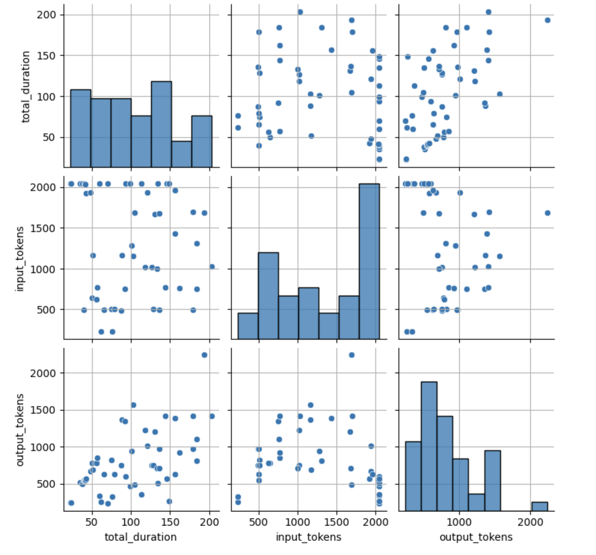

# data center
## Run benchmark
ref : https://developer.nvidia.com/dcgm

- add repo
```
wget https://developer.download.nvidia.com/compute/cuda/repos/ubuntu2004/x86_64/cuda-keyring_1.0-1_all.deb
sudo dpkg -i cuda-keyring_1.0-1_all.deb
sudo add-apt-repository "deb https://developer.download.nvidia.com/compute/cuda/repos/ubuntu2004/x86_64/ /"
```

- install
```
sudo apt-get update \
&& sudo apt-get install -y datacenter-gpu-manager
```

- run
```
sudo dcgmi diag -r 1
sudo dcgmi diag -r 2
sudo dcgmi diag -r 3
sudo dcgmi diag -r 4
```

## Exporter for grafana
- run docker

    ```
    docker run -d --gpus all -e DCGM_EXPORTER_INTERVAL=100 --cap-add SYS_ADMIN --rm -p 9400:9400 nvcr.io/nvidia/k8s/dcgm-exporter:4.2.0-4.1.0-ubuntu22.04
    ```
    - DCGM_EXPORTER_INTERVAL : Interval for fetch data from nvidia-smi

- run python code
    - required
        - pandas
        - matplotlib
        - seaborn
    - run [benchmark.py](./benchmark.py)
    ```
    python benchmark.py
    ```
    - output like this
        ```
        Starting GPU metrics collection...
        Starting load test with 50 concurrent requests...
        Stopping GPU metrics collection...

        ### Load Test Results ###
        #### Input Parameters
        - **Input query tokens per request**: 1317.76
        - **Number of requests per second**: 0.24
        #### Process
        - **LLM processing time**: 103.34 seconds
        - **Average GPU core utilization**: 78.79%
        - **Average GPU memory utilization**: 81.29%
        #### Output Parameters
        - **Output tokens per request**: 791.96

        Total duration: 204.64 seconds
        Total requests: 50
        ```
    